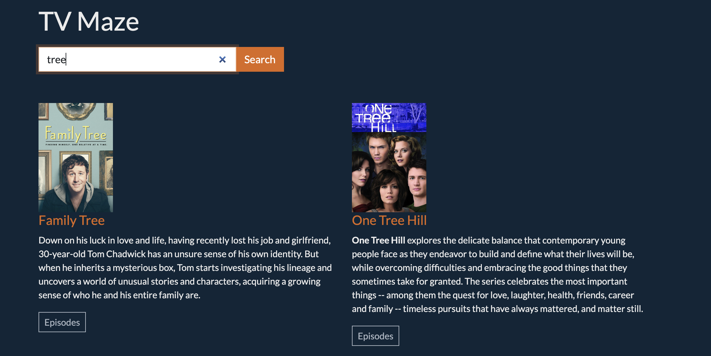

# bc15_tvMazeAPI
This is a solution to an API Practice Challenge, using TV Maze. 

## Table of contents

- [Overview](#overview)
  - [The challenge](#the-challenge)
  - [Screenshot](#screenshot)
  - [Links](#links)
- [My process](#my-process)
  - [Built with](#built-with)
  - [What I learned](#what-i-learned)
  - [Continued development](#continued-development)
  - [Useful resources](#useful-resources)
- [Author](#author)

## Overview

In this exercise, you'll work with some existing code and a slightly more complex API. You'll be making AJAX requests, doing DOM manipulation, and thinking about reusable functions and testable code. We'll have some extra challenges here that will push your understanding of AJAX and JavaScript!.

### The challenge

Users should be able to:

- use the search bar to search 5h3 TV Maze API for related TV Shows by entering some letters
- click an “Episodes” button at the bottom of a show card that shows the episodes for this show at the bottom of the page.

### Screenshot




### Links

- Solution URL: https://github.com/TechEdDan2/bc15_tvMazeAPI
- Live Site URL: N/A

## My process

### Built using

- DOM 
- Javacript
- JQuery
- Axios

### What I learned

The main focus of this project was to interact with the TV Maze API through get requests. I am new to using Axios and get requests, so this was great practice. I am starting to feel more confident with creating GET requests to return specific data that I need. I was proud of the makeBoldLetters solution, but wonder about other ways to solve this identified problem.   

Code snippets:


```js
/**
 * Given a show ID, get data from the API about episodes
 * 
 * @param {number} id - the id for the show
 * @returns array of episodes:
 *      { id, name, season, number }
 */
async function getEpisodesOfShow(id) {
  const response = await axios({
    baseURL: ROOT_API_URL,
    url: `shows/${id}/episodes`,
    method: 'get',
  });

  // Returns the newly created array populated with the results 
  //  of calling a function on every element in the data array 
  //  to extract the id, name, summary, and image
  return response.data.map(function (episode) {
    return {
      id: episode.id,
      name: episode.name,
      season: episode.season,
      number: episode.number
    }
  });

}
```

### Continued development

So as with most of my challenges, I am always unsure of best practices. This is part of the reason I am completing the Bootcamp. In the future, I would like to incorporate tests for my functions. I know that practice writing software tests in a great way to get better at this critical developer skill! I would also like to add other information/features from TVMaze. There are other things you can get from TV Maze -- I could list the actors in a show, or the genres of a show, or other data.


### Useful resources

- [MDN](https://developer.mozilla.org/en-US/docs/Web/API/Document_Object_Model) - This helped me when using the Document Object Model to create this project. 
- [Axios API](https://axios-http.com/docs/api_intro) - The Axios API docs helped a lot to review syntax and look up functions. 
- [Udemy](https://www.udemy.com/course/the-web-developer-bootcamp) - This Udemy course has helped me to brush up on how to use the DOM. I'd recommend it to anyone still learning this concept.
- [Springboard](https://www.springboard.com/) - This is the Bootcamp where I am currently gaining a deeper understanding of JavaScript and many other full stack languages, workflows, and concepts.  

## Author

- Frontend Mentor - [@TechEdDan2](https://www.frontendmentor.io/profile/TechEdDan2)
